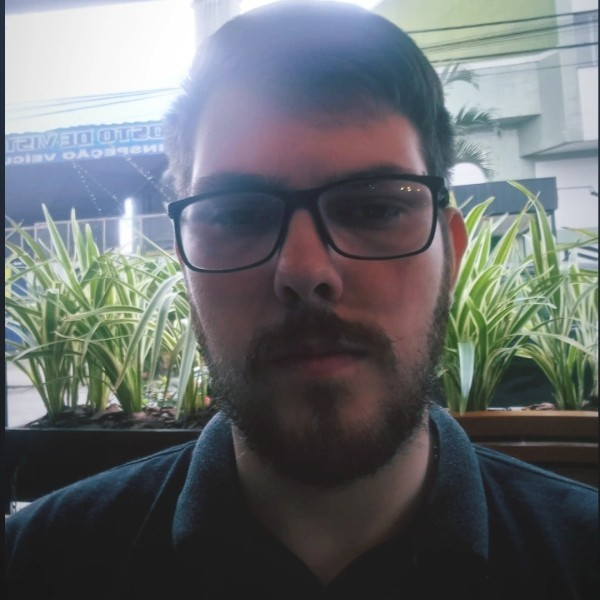
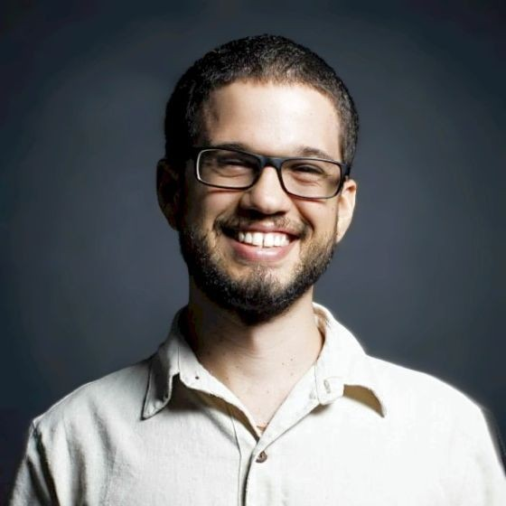
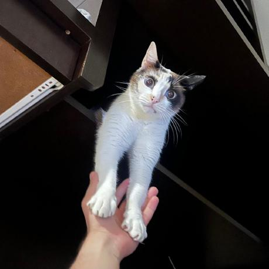
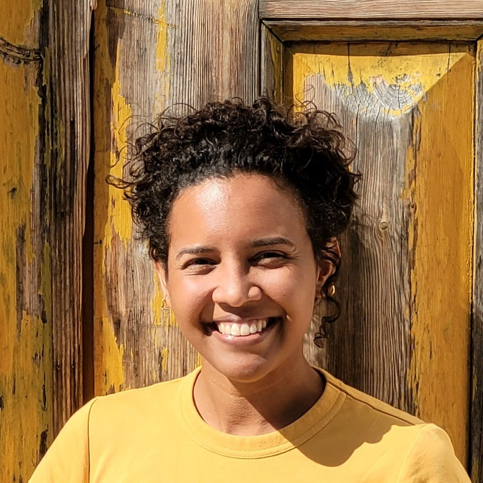

# Programação de Elixir Curitiba 2025

[Voltar à página inicial](.././index.md)

__Em construção.__

<!--

09:00 – 09:15 | Abertura – Adolfo Neto (15 min)

09:15 – 09:35 | StoryTellerEx – Davi Wasserberg (20 min)

09:35 – 10:35 | Erlang Distribuído: Escalabilidade e Tolerância a Falhas – Fernando Areias (60 min)

10:35 – 11:35 | A visão de Joe Armstrong – Pedro Castilho (60 min)

11:35 – 12:35 | Experiências da Trio com o Elixir – Manoel Souza (60 min)

12:35 – 14:35 | Almoço (2h)

14:35 – 14:55 | SQLite em produção e OOM kills – Yuri Oliveira (20 min)

14:55 – 15:15 | LFE - code is data is code – Bruno Dias (20 min)

15:15 – 15:35 | Elixir em Produção na MeetRox – Thiago Zattar (20 min)

15:35 – 16:05 | Coffee Break (30 min)

16:05 – 17:05 | Escalando Elixir na Prática – Lívia Barbosa (60 min)

17:05 – 18:00 | Encerramento, Q&A, networking, buffer final (55 min)

-->

## Índice
- [Programação de Elixir Curitiba 2025](#programação-de-elixir-curitiba-2025)
  - 9h00 [Abertura](#abertura)
  - 9h15 [StoryTellerEx: Agentes Erlang e LLMs para narração de RPGs](#storytellerex-agentes-erlang-e-llms-para-narração-de-rpgs)
  - [A visão de Joe Armstrong: resiliência no mundo real](#a-visão-de-joe-armstrong-resiliência-no-mundo-real)
  - [Experiências da Trio com o Elixir](#experiências-da-trio-com-o-elixir)
  - [Erlang Distribuído: Escalabilidade e Tolerância a Falhas](#erlang-distribuído-escalabilidade-e-tolerância-a-falhas)
  - [SQLite em produção e OOM kills](#sqlite-em-produção-e-oom-kills)
  - [LFE - code is data is code (de novo)](#lfe---code-is-data-is-code-de-novo)
  - [Escalando Elixir na Prática: Lições da Manutenção e Otimização de uma Base Monolítica (provisório)](#escalando-elixir-na-prática-lições-da-manutenção-e-otimização-de-uma-base-monolítica-provisório)
  - [Elixir em Produção na MeetRox (provisório)](#elixir-em-produção-na-meetrox-provisório)

---

## Abertura

**Responsável:** Adolfo Neto

**Site**: <https://adolfont.github.io/>

**Bio:** Adolfo Neto é professor na Universidade Tecnológica Federal do Paraná (UTFPR), onde atua no [Programa de Pós-Graduação em Computação Aplicada](https://www.utfpr.edu.br/cursos/programas-de-pos-graduacao/ppgca-ct). Com forte envolvimento na comunidade de desenvolvimento funcional e concorrente, ele é cofundador do podcast Elixir em Foco, voltado à divulgação da linguagem Elixir e do ecossistema BEAM no Brasil. Internacionalmente, Adolfo também contribui como líder do grupo de Educação, Treinamento e Adoção da [Erlang Ecosystem Foundation](https://bit.ly/3Jma95g), promovendo o ensino e a adoção de tecnologias como Erlang, Elixir e Gleam.

**Resumo:** Informações sobre o evento.

**Duração:** 15 minutos

---

## StoryTellerEx: Agentes Erlang e LLMs para narração de RPGs

**Palestrante:** Davi Abreu Wasserberg

**Site**: <https://www.linkedin.com/in/davi-abreu-wasserberg-a9a67690/>

**Bio:** Engenheiro de Software na Ingresse. Um seguidor de José, herdeiro de Davi, Dev Senior Fullstack (Elixir).

**Resumo:** Apresentaremos como agentes Erlang/PostgreSQL gerenciados pelo Gemini, com controle de recursos inteligente usando apenas quotas free diárias, podem dar vida a uma boa história.

**Duração:** 20 minutos

---

## A visão de Joe Armstrong: resiliência no mundo real

**Palestrante:** Pedro Castilho

**Sites**: <http://x.com/coproduto> , <http://linkedin.com/in/pcstl> , <http://bsky.app/profile/coprodu.to> 

**Episódios do Elixir em Foco**: [1. Elixir em Produção com Pedro Castilho, CTO da Comadre](https://open.spotify.com/episode/5jA7u97KpcE5nJbuAOsWoU) e [Mesa Redonda com Pedro Castilho, Vitor Leal e Elaine Naomi Watanabe](https://open.spotify.com/episode/3EI3OcRQyWlUqUceKJMlPj)

**Bio:** Sou CTO na Cumbuca. Trabalho com pagamentos usando Elixir desde o ano de 2020 e sou divulgador da programação funcional desde bem antes disso. 

**Resumo:** É frequente novatos em Erlang ou Elixir ouvirem falar sobre como essas linguagens permitem criar sistemas de alta disponibilidade - mas frequentemente isso fica só no mundo abstrato. Não é óbvio como os comportamentos da OTP garantem essas propriedades em sistemas reais.

Nesta palestra, iremos partir dos princípios filosóficos por trás da criação do Erlang, a partir dos materiais que Joe Armstrong produziu sobre a linguagem, e criar uma correlação entre as ideias que entraram na criação da linguagem, os construtos que temos à disposição na OTP, e finalmente conectar isso com como construímos infraestrutura de pagamentos de altíssima disponibilidade na Cumbuca - levando a ideia de resiliência da teoria até a prática.

**Duração:** 40 minutos

---

## Experiências da Trio com o Elixir

**Palestrante:** Manoel Souza

**Site**: <https://www.linkedin.com/in/manoel-souza>

**Bio:** CTO na Trio

**Resumo:** Na Trio decidimos usar o Elixir em toda a stack. Mas quais ferramentas estamos usando e quais foram as nossas experiências?

**Duração:** 40 minutos

---

## Erlang Distribuído: Escalabilidade e Tolerância a Falhas

**Palestrante:** Fernando Areias

**Site**: <linkedin.com/in/fernando-calheiros>

**Bio:** Engenheiro de Software na Elo e mestrando no Programa de Pós-Graduação em Computação Aplicada (PPGCA) da UTFPR, onde investigo formas de melhorar a escalabilidade do modelo de distribuição de Erlang.

**Resumo:** Nesta apresentação, pretendo mostrar como funciona a distribuição do ERTS, destacando os protocolos envolvidos, como EPMD e o Erlang Distribution Protocol (ErlDP). Também vou apresentar um projeto desenvolvido pelo grupo de estudo Erlang Brasil: um servidor de chamadas de procedimentos remotos (RPC) distribuído, que exemplifica na prática o uso desses mecanismos. O código está disponível em: <https://github.com/Erlang-Brasil/rpc_server/tree/feature/dist>.

**Duração:** 40 minutos

---

## SQLite em produção e OOM kills

**Palestrante:** Yuri Oliveira

**Site**: <https://bsky.app/profile/yuri.omg.lol>, <https://www.linkedin.com/in/yurioliveira/>

**Bio:** Engenheiro de software trabalhando com edge computing, BEAM clusters, backend e gestão de equipes.

**Resumo:** SQLite é um banco de dados capaz de lidar com grandes sistemas em produção. Como criamos um cluster multitenancy e distribuído com SQLite e quais limitações observamos.

**Duração:** 20 minutos

---

## LFE - code is data is code (de novo)

**Palestrante:** Bruno Dias

**Site**: <https://github.com/diasbruno>, <https://www.linkedin.com/in/brunodiash/>, <https://diasbruno.github.io/>

**Bio:** Sou engenheiro de software sênior e atualmente trabalho com Common Lisp, Haskell, Elm e Javascript/Typescript. Mas também com Ruby e Python. F#, C/C++, Rust e Go estão na minha lista de interesses.

Atualmente, estou trabalhando em sistemas de metaprogramação para aproveitar o poder da geração de código em tempo de execução e compilação, visando muitas linguagens usando Common Lisp.

**Resumo:** Utilizações de conceitos de geração de código para simplificar aplicações.

**Duração:** 20 minutos

--- 

## Escalando Elixir na Prática: Lições da Manutenção e Otimização de uma Base Monolítica (provisório)

**Palestrante:** (a confirmar) Livia Almeida Barbosa

**Site**: <https://www.linkedin.com/in/liviaab>

**Episódio do Elixir em Foco**: [Elixir em Produção na Remote, com Lívia Almeida Barbosa
](https://open.spotify.com/episode/1n7gYER9Ye2LaVQAGpOvIb)

**Bio:**  Senior Backend Engineer I na Remote.  Graduada e Mestre em Ciência da Computação. Desenvolvedora full-stack com o objetivo de resolver novos desafios e sair da zona de conforto. Promotora de um ambiente de trabalho mais inclusivo e diversificado.

**Resumo:** A definir

**Duração:** 40 minutos

--- 

## Elixir em Produção na MeetRox (provisório) 

**Palestrante:** (a confirmar) Thiago Zattar da Silveira

**Site**: <https://www.linkedin.com/in/thiago-zattar-da-silveira/>

**Episódio do Elixir em Foco**: [Elixir em produção na MeetRox, com Ana Dubas e Thiago Zattar da Silveira](https://open.spotify.com/episode/1YEORioUUESltu6B7DpgiQ)

**Bio:**  Co-founder & CTO at MeetRox

**Resumo:** A definir

**Duração:** 20 minutos

--- 

