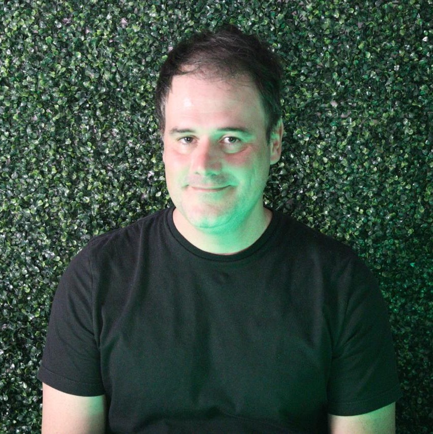

# Programação de Elixir Curitiba 2025

[Voltar à página inicial](.././index.md)

__Em construção.__

## Índice
- [Programação de Elixir Curitiba 2025](#programação-de-elixir-curitiba-2025)
  - 9h00 [Abertura](#abertura)
  - 9h15 [StoryTellerEx: Agentes Erlang e LLMs para narração de RPGs](#storytellerex-agentes-erlang-e-llms-para-narração-de-rpgs)
  - [A visão de Joe Armstrong: resiliência no mundo real](#a-visão-de-joe-armstrong-resiliência-no-mundo-real)
  - [Experiências da Trio com o Elixir](#experiências-da-trio-com-o-elixir)

---

## Abertura

**Responsável:** Adolfo Neto

**Site**: <https://adolfont.github.io/>

**Bio:** Adolfo Neto é professor na Universidade Tecnológica Federal do Paraná (UTFPR), onde atua no [Programa de Pós-Graduação em Computação Aplicada](https://www.utfpr.edu.br/cursos/programas-de-pos-graduacao/ppgca-ct). Com forte envolvimento na comunidade de desenvolvimento funcional e concorrente, ele é cofundador do podcast Elixir em Foco, voltado à divulgação da linguagem Elixir e do ecossistema BEAM no Brasil. Internacionalmente, Adolfo também contribui como líder do grupo de Educação, Treinamento e Adoção da [Erlang Ecosystem Foundation](https://bit.ly/3Jma95g), promovendo o ensino e a adoção de tecnologias como Erlang, Elixir e Gleam.

**Resumo:** Informações sobre o evento.

**Duração:** 15 minutos

---

## StoryTellerEx: Agentes Erlang e LLMs para narração de RPGs

**Palestrante:** Davi Abreu Wasserberg

**Site**: <https://www.linkedin.com/in/davi-abreu-wasserberg-a9a67690/>

**Bio:** Engenheiro de Software na Ingresse. Um seguidor de José, herdeiro de Davi, Dev Senior Fullstack (Elixir).

**Resumo:** Apresentaremos como agentes Erlang/PostgreSQL gerenciados pelo Gemini, com controle de recursos inteligente usando apenas quotas free diárias, podem dar vida a uma boa história.

**Duração:** 20 minutos

---

## A visão de Joe Armstrong: resiliência no mundo real

**Palestrante:** Pedro Castilho

**Sites**: <http://x.com/coproduto> , <http://linkedin.com/in/pcstl> , <http://bsky.app/profile/coprodu.to> 

**Bio:** Sou CTO na Cumbuca. Trabalho com pagamentos usando Elixir desde o ano de 2020 e sou divulgador da programação funcional desde bem antes disso. 

**Resumo:** É frequente novatos em Erlang ou Elixir ouvirem falar sobre como essas linguagens permitem criar sistemas de alta disponibilidade - mas frequentemente isso fica só no mundo abstrato. Não é óbvio como os comportamentos da OTP garantem essas propriedades em sistemas reais.

Nesta palestra, iremos partir dos princípios filosóficos por trás da criação do Erlang, a partir dos materiais que Joe Armstrong produziu sobre a linguagem, e criar uma correlação entre as ideias que entraram na criação da linguagem, os construtos que temos à disposição na OTP, e finalmente conectar isso com como construímos infraestrutura de pagamentos de altíssima disponibilidade na Cumbuca - levando a ideia de resiliência da teoria até a prática.

**Duração:** 40 minutos

---

## Experiências da Trio com o Elixir

**Palestrante:** Manoel Souza

**Site**: <https://www.linkedin.com/in/manoel-souza>

**Bio:** CTO e Fundador da Trio

**Resumo:** 

**Duração:** 40 minutos