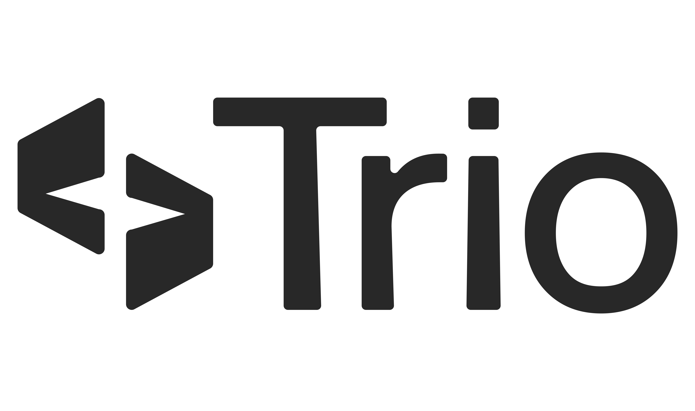

# Elixir Curitiba 2025

A Elixir Curitiba 2025 está confirmada para sábado 08/11/2025.

Os ingressos podem ser comprados em <https://www.ingresse.com/elixir-curitiba-2025/>.

Local: [Banco Senff](https://bit.ly/BancoSenffSiteElixirCuritiba) - [Av. Sen. Souza Naves, 1240 - Cristo Rei, Curitiba - PR, 80050-152](https://share.google/eQGxiKHFiVYSEmkWU)

## [Programação](2025/programacao.md)

<!-- 
Já tem ideia de palestra ou atividade? Submeta em <https://bit.ly/CFT_ElixirBrasil> até 30/09/2025.

Quer patrocinar o evento?  Quer ajudar a organizar? Entre em contato por elixiremfoco@gmail.com!

-->

## Apoio 

 

 

  

## Release

**Elixir Curitiba 2025**

A Elixir Curitiba 2025 acontecerá em **Curitiba, Paraná, Brasil, no dia 08 de novembro de 2025**, reunindo novamente a comunidade da BEAM para um dia inteiro dedicado à linguagem **Elixir** e ao ecossistema de **Erlang**. O evento será realizado no **Banco Senff – Av. Sen. Souza Naves, 1240 – Cristo Rei, Curitiba – PR, 80050-152**.

Assim como em 2024, o encontro contará com **palestras inspiradoras**, **trocas de experiências**, **oportunidades de networking** e um ambiente acolhedor que valoriza tanto quem já tem experiência com programação funcional quanto quem está dando os primeiros passos. O idioma principal do evento será o **português**, facilitando a participação da comunidade local.

Em 2024, o evento reuniu desenvolvedores, entusiastas e pesquisadores, oferecendo momentos ricos de aprendizado e colaboração. Para 2025, esperamos repetir e ampliar esse sucesso, fortalecendo ainda mais a comunidade Elixir em Curitiba e no Brasil.

**Informações importantes:**

* **Data:** 08/11/2025
* **Local:** Banco Senff – Av. Sen. Souza Naves, 1240 – Cristo Rei, Curitiba – PR
* **Classificação Etária:** Permitida a entrada de menores de 18 anos acompanhados de responsáveis
* **Transferência de ingressos:** Sim
* **Contato:** [elixiremfoco@gmail.com](mailto:elixiremfoco@gmail.com)

**Organização:**
Adolfo Neto – DAINF UTFPR e PPGCA

**Apoio:**

* [Trio](https://www.linkedin.com/company/trio-fin) Pagamentos
* Banco [Senff](https://www.linkedin.com/company/senff/)
* [Ingresse](https://www.linkedin.com/company/ingresse)
* Podcast Elixir em Foco
* Emílias – Armação em Bits
* Programa de Pós-Graduação em Computação Aplicada da UTFPR Curitiba
* Rede Emílias de Podcasts

**Participe da comunidade Elixir CWB no Telegram e acompanhe as novidades.**

Elixir Curitiba é o espaço para **se conectar, aprender e crescer** com a comunidade Elixir no Brasil.

## Equipe Organizadora

- Adolfo Neto (DAINF e [PPGCA UTFPR](https://www.utfpr.edu.br/cursos/programas-de-pos-graduacao/ppgca-ct)) - coordenador do evento.
- Fernando Areias (Engenheiro de Software na Elo e Mestrando no [PPGCA UTFPR](https://www.utfpr.edu.br/cursos/programas-de-pos-graduacao/ppgca-ct)) - voluntário
- [Adriano Santos](https://github.com/sleipnir) - membro do Comitê de Programa
- [Fabricio Damazio](https://github.com/FabriDamazio)
- e mais

## Palestrantes cujas propostas foram aceitas

- Manoel Souza (Trio Pagamentos)
- Davi Abreu Wasserberg (Ingresse)
- Fernando Areias
- Pedro Castilho
- Yuri Oliveira

## Outros eventos interessantes no segundo semestre de 2025

- [SBQS - 4 a 7 de novembro em São José dos Campos](https://sbqs.sbc.org.br/2025/index.php/pt/)
- [Gambiconf - 29 e 30 de Novembro em São Paulo](https://gambiconf.dev/)

## Entre na comunidade [Elixir CWB](https://t.me/elixir_cwb) no Telegram.

[🇬🇧 This page in English](./2025/index_en)

[Sobre a Elixir Curitiba 2024](./2024)
