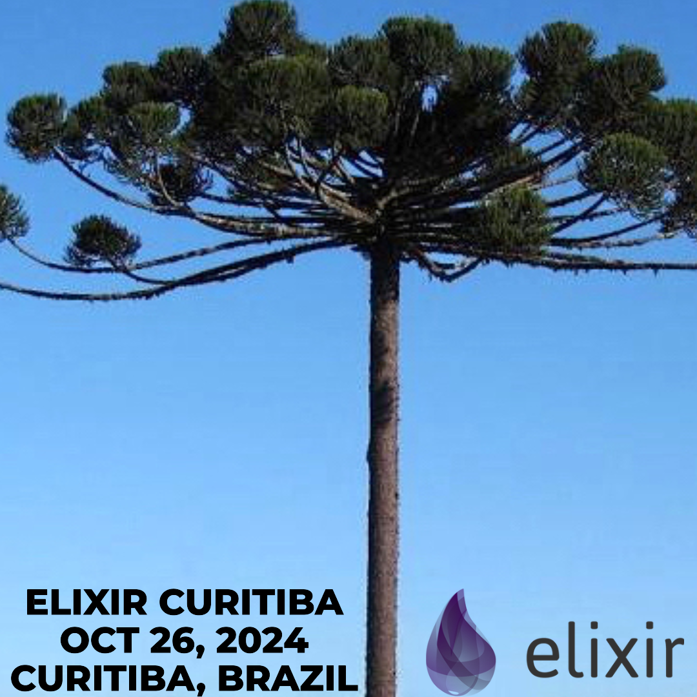

Junte-se a nós em Curitiba, Paraná, Brasil, no dia 26 de outubro de 2024, para um dia inteiro dedicado à linguagem Elixir e ao ecossistema Erlang. A Elixir Curitiba 2024 reunirá desenvolvedores, entusiastas e especialistas de toda a comunidade para compartilhar conhecimentos, ideias e inovações. Espere palestras inspiradoras de líderes da indústria, oportunidades de networking com profissionais que compartilham os mesmos interesses e um ambiente vibrante celebrando o poder da programação funcional. O idioma principal do evento será o português, tornando-o acessível à comunidade local. Seja você um desenvolvedor experiente ou esteja apenas começando sua jornada com Elixir, este evento é a oportunidade perfeita para se conectar, aprender e crescer. Não perca a chance de fazer parte do movimento Elixir no Brasil!

[Interesse em participar da Elixir Curitiba](https://forms.gle/p91ccyq183za9Jap7)

[Chamada de Palestras / Call for Talks](https://bit.ly/3WVraf5)

Local do evento: R. Pasteur, 463 - Batel, Curitiba - PR, 80250-104 (Escritório da Trio)

Quer mais informações? Mande e-mail para adolfo.utfpr@gmail.com ou mensagem direta para adolfont no Telegram.

Entre na comunidade [Elixir CWB](https://t.me/elixir_cwb) no Telegram.

<!-- 

-->

[Comissão Organizadora](organizacao.md)

Apoio:
- [Trio Pagamentos](https://bit.ly/46Blavj)
- [Podcast Elixir em Foco](https://bit.ly/4clOOpD)
- [Emílias - Armação em Bits](https://bit.ly/46DJa0M)
- [Programa de Pós-Graduação em Computação Aplicada da UTFPR Curitiba](https://bit.ly/4dfARLe)
- [Rede Emílias de Podcasts](https://fronteirases.github.io/redeemilias/)
